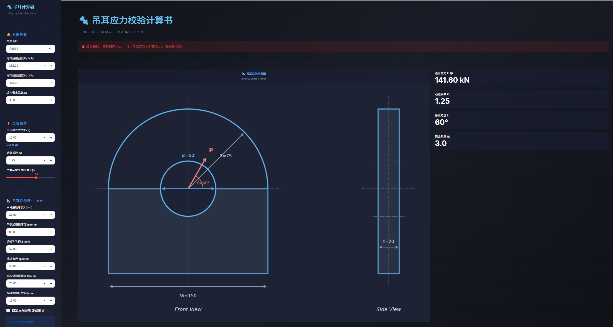

# 吊耳计算器

一个基于 Streamlit 的吊耳应力校核工具，用于对吊耳的关键受力指标进行快速计算、结果展示与 Word 计算书导出。

本项目适合作为工程方案比选、参数试算和内部技术讨论辅助工具，强调轻量、直观和可快速验证。

---

## 功能特性

- 材料参数输入与自定义
- 载荷、角度、几何尺寸参数化输入
- 吊耳核心应力快速校核
- 吊耳二维几何示意图展示
- Word 格式计算书导出
- 基础输入合法性校验
- 核心计算最小回归测试

---

## 截图

## 页面截图

### 主界面


### 计算过程与结果


---

## 运行环境

- Python 3.10 及以上
- Windows / macOS / Linux
- 推荐使用虚拟环境

---

## 安装依赖

```bash
python -m pip install -r requirements.txt
```

---

## 启动方式

```bash
python -m streamlit run app.py
```

启动后在浏览器打开：

```text
http://localhost:8501
```

---

## 使用说明

### 1. 输入材料参数

在左侧栏选择材料牌号，或切换为“自定义”后手动输入：

- 材料屈服强度 `Fy`
- 材料抗拉强度 `Fu`
- 结构安全系数 `Ns`

### 2. 输入工况载荷

输入以下参数：

- 单只吊耳受力 `Fv (t)`
- 动载系数 `Kd`
- 吊索与水平面夹角 `θ`

程序会自动将吨换算为 `kN`。

### 3. 输入几何尺寸

输入或调整：

- 吊耳主板厚度 `t`
- 单侧加强板厚度 `tp`
- 销轴孔孔径 `d`
- 销轴直径 `dp`
- 孔心至边缘距离 `R`
- 焊缝焊脚尺寸 `hf`
- 吊耳根部宽度 `W`

默认情况下：

- `W = 2R`

也可以启用自定义宽度。

### 4. 查看结果

程序会展示：

- 综合校核结论
- 四项应力指标的通过 / 不通过状态
- 吊耳几何示意图
- 详细计算过程
- 汇总表格

### 5. 导出计算书

点击“导出 Word 报告”按钮，即可导出 `.docx` 格式计算书。

---

## 参数说明

| 参数 | 含义 | 单位 |
|------|------|------|
| `Fv` | 单只吊耳受力 | t |
| `Kd` | 动载系数 | - |
| `θ` | 吊索与水平面夹角 | ° |
| `Fy` | 材料屈服强度 | MPa |
| `Fu` | 材料抗拉强度 | MPa |
| `Ns` | 结构安全系数 | - |
| `t` | 吊耳主板厚度 | mm |
| `tp` | 单侧加强板厚度 | mm |
| `d` | 销轴孔孔径 | mm |
| `dp` | 销轴直径 | mm |
| `R` | 孔心至边缘距离 | mm |
| `hf` | 焊缝焊脚尺寸 | mm |
| `W` | 吊耳根部宽度 | mm |

---

## 当前实现说明

当前版本主要面向：

- 快速试算
- 尺寸敏感性分析
- 工程讨论中的初步校核

程序目前采用的是简化工程校核逻辑，并不等同于完整规范条文逐条展开的正式设计计算流程。

如果用于正式项目，请结合适用标准、具体工况、制造要求及专业审核进行复核。

---

## 测试

运行最小回归测试：

```bash
py -m unittest discover -s tests -v
```

---

## 项目结构

```text
.
├─ app.py
├─ requirements.txt
├─ README.md
├─ tests/
│  └─ test_calculate_lug_stresses.py
└─ .gitignore
```

---

## 后续计划

可考虑逐步完善以下内容：

- 进一步拆分计算逻辑与界面逻辑
- 增加更多边界条件测试
- 补充标准依据说明
- 增加示例工况与截图
- 优化导出报告格式

---

## 免责声明

本项目仅供学习、演示、参数试算与工程参考使用。

- 不构成正式设计文件
- 不替代规范计算书
- 不替代第三方审查
- 不替代持证工程师判断

因使用本工具而产生的任何直接或间接后果，使用者需自行承担责任。

在实际工程应用中，请务必结合项目条件、适用规范、制造工艺、焊接要求、载荷工况及专业工程师审核结果综合判断。

---

## License

